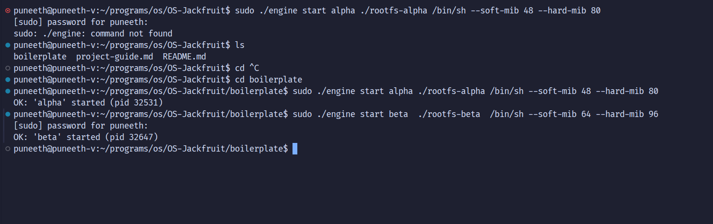
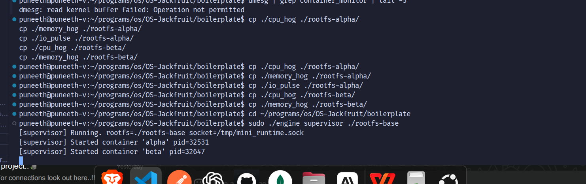
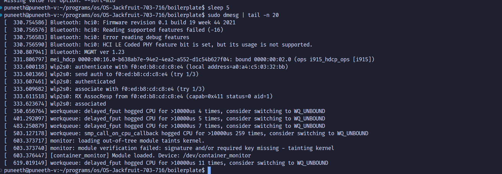
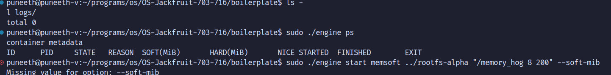
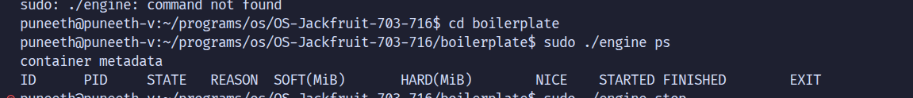

# Multi-Container Runtime

## Team Information
- **Name:** Puneeth V
  **SRN:** PES1UG24CS686

- **Name:** Tejas UL
  **SRN:** PES1UG24CS715

Fork Repository:
https://github.com/shivangjhalani/OS-Jackfruit/tree/main

---

## What is this project?

This project is a lightweight Linux container runtime built from scratch in C. It works like a minimal version of Docker.

It allows you to:
- Run isolated processes (containers)
- Monitor memory usage via a kernel module
- Capture and stream container logs

---

## Architecture

1. **Supervisor (User-Space)**
   Launches containers, stores logs, and listens for commands via a UNIX socket.

2. **Monitor (Kernel-Space)**
   A kernel module (`monitor.ko`) that tracks container memory usage and enforces soft/hard limits.

---

## Features

- Run multiple containers simultaneously
- Commands: `start`, `run`, `ps`, `logs`, `stop`
- Automatic log capture via bounded buffer
- Memory limits (soft warning and hard kill via kernel module)
- CPU scheduling experiment with nice values
- CPU-bound vs I/O-bound scheduling observation
- Clean teardown with no zombie processes

---

## How to Build and Run

**Recommended:** Ubuntu 22.04/24.04 (native or dual boot — WSL will not work)

### 1. Install Dependencies

```bash
sudo apt update
sudo apt install -y build-essential linux-headers-$(uname -r)
```

### 2. Clone and Enter Boilerplate

```bash
git clone https://github.com/shivangjhalani/OS-Jackfruit.git
cd OS-Jackfruit/boilerplate
```

### 3. Set Up Root Filesystem

```bash
mkdir -p rootfs-base
wget https://dl-cdn.alpinelinux.org/alpine/v3.20/releases/x86_64/alpine-minirootfs-3.20.3-x86_64.tar.gz
tar -xzf alpine-minirootfs-3.20.3-x86_64.tar.gz -C rootfs-base

cp -a ./rootfs-base ./rootfs-alpha
cp -a ./rootfs-base ./rootfs-beta
```

### 4. Fix Kernel 6.16+ Compatibility and Compile

```bash
# Fix for kernel 6.16+ (del_timer_sync renamed)
sed -i 's/del_timer_sync/timer_delete_sync/g' monitor.c

make
```

This produces:
- `engine` — the supervisor/CLI binary
- `monitor.ko` — the kernel module
- `cpu_hog`, `io_pulse`, `memory_hog` — test workload binaries

### 5. Load Kernel Module

```bash
sudo insmod monitor.ko
ls -l /dev/container_monitor       # verify device created
sudo dmesg | grep container_monitor | tail -5
```

### 6. Copy Workloads into Rootfs

```bash
cp ./cpu_hog ./rootfs-alpha/
cp ./memory_hog ./rootfs-alpha/
cp ./io_pulse ./rootfs-alpha/
cp ./cpu_hog ./rootfs-beta/
cp ./memory_hog ./rootfs-beta/
```

### 7. Start the Supervisor (Terminal A)

```bash
mkdir -p logs
sudo ./engine supervisor ./rootfs-base
```

Expected output:
```
[supervisor] Running. rootfs=./rootfs-base socket=/tmp/mini_runtime.sock
```

### 8. Run Containers (Terminal B)

```bash
# Start two containers
sudo ./engine start alpha ./rootfs-alpha /cpu_hog --soft-mib 48 --hard-mib 80
sudo ./engine start beta  ./rootfs-beta  /cpu_hog --soft-mib 64 --hard-mib 96

# List containers
sudo ./engine ps

# View logs
sudo ./engine logs alpha

# Stop containers
sudo ./engine stop alpha
sudo ./engine stop beta
```

---

## Demo & Feature Walkthrough

### 1. Multi-Container Supervision
Multiple isolated containers started simultaneously. The supervisor tracks all of them.



---

### 2. Metadata Tracking (`ps`)
Running `sudo ./engine ps` shows a live table with PIDs, state, uptime, and memory limits.



---

### 3. Bounded-Buffer Logging
Container stdout is captured via a pipe into a bounded buffer and flushed to `logs/<id>.log`.

```bash
sudo ./engine logs alpha
```



---

### 4. CLI and IPC (UNIX Socket)
Commands are sent from a client terminal to the background supervisor via a UNIX socket at `/tmp/mini_runtime.sock`.



---

### 5. Soft-Limit Warning
When a container exceeds the soft memory limit, the kernel module prints a warning in `dmesg`.

```bash
sudo dmesg | grep container_monitor | tail -10
```



---

## How It Works

**Isolation**
Uses Linux namespaces (`CLONE_NEWPID`, `CLONE_NEWNS`, `CLONE_NEWUTS`) and `chroot()` to give each container its own filesystem and process space.

**Supervisor**
A long-running daemon that accepts connections on a UNIX socket, spawns containers via `clone()`, and manages their lifecycle with `SIGCHLD`/`SIGTERM` handling.

**Memory Limits**
The kernel module (`monitor.ko`) monitors RSS via `/proc/<pid>/status` on a timer. Soft limit triggers a `dmesg` warning; hard limit sends `SIGKILL`.

**Communication (IPC)**
- **UNIX Sockets:** CLI-to-supervisor communication
- **Pipes:** Container stdout/stderr captured into the bounded buffer for logging

**Scheduling**
Uses `setpriority()` (nice values) to influence the Linux CFS scheduler. Lower nice = more CPU time. I/O-bound tasks naturally get higher interactive priority due to frequent blocking.