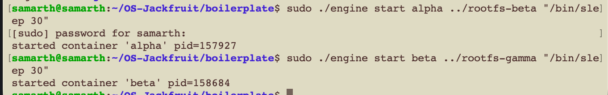
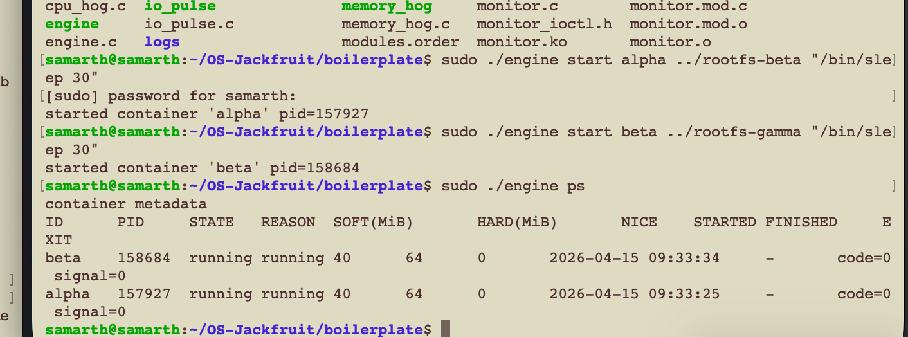
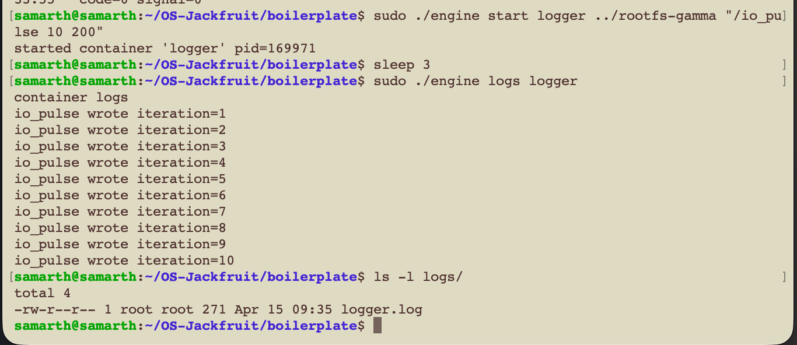
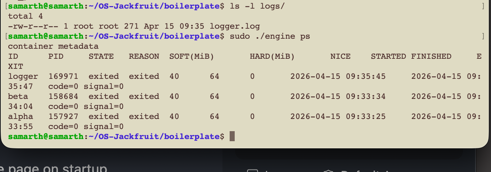
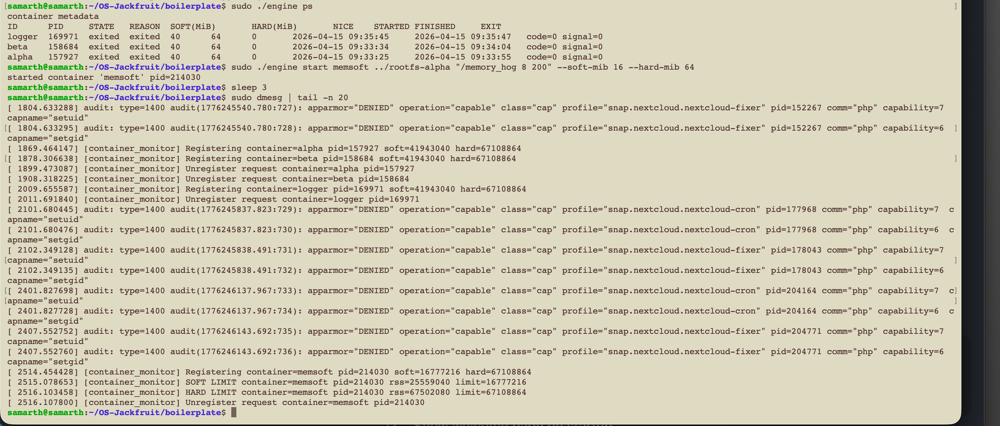
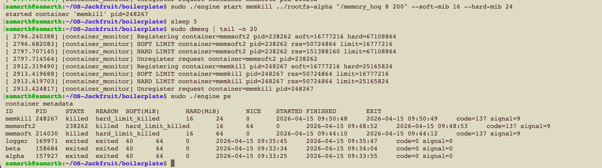
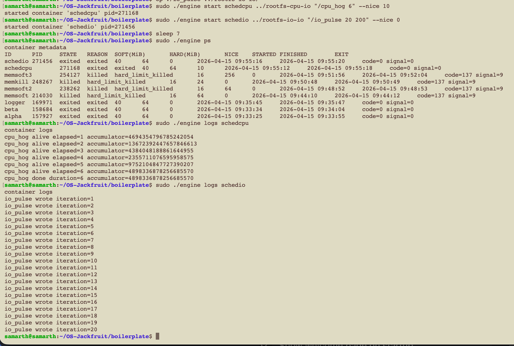
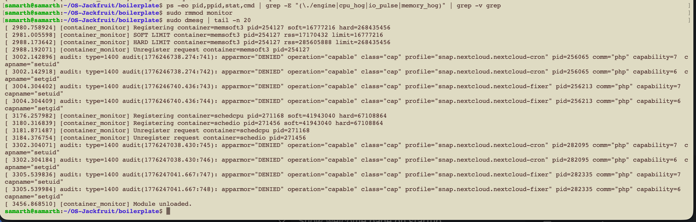

# Multi-Container Runtime

## Team Information
- Name: Samarth Mohan  
  SRN: PES1UG24CS703  

- Name: Sujeet V Bire  
  SRN: PES2UG24CS716  

Fork Repository:  
https://github.com/8figalltimepro/OS-Jackfruit  

---

## What is this project?

This project is a lightweight Linux container runtime built from scratch in C. It works like a minimal version of Docker.

It allows you to:
- Run isolated processes (containers)
- Monitor memory usage
- Capture logs

---

## Architecture

1. Supervisor (User-Space)  
   Launches containers, stores logs, and listens for commands.

2. Monitor (Kernel-Space)  
   A kernel module that tracks container memory usage.

---

## Features

- Run multiple containers simultaneously  
- Commands: `start`, `ps`, `logs`, `stop`  
- Automatic log capture  
- Memory limits (soft warning and hard kill)  
- CPU vs I/O scheduling experiment  

---

## How to Build and Run

Recommended: Ubuntu VM  
Mac M1: Use `aarch64` Alpine image  

### 1. Install Dependencies

```bash
sudo apt update
sudo apt install -y build-essential linux-headers-$(uname -r)
```

### 2. Set Up Filesystem

```bash
mkdir -p rootfs-base

wget https://dl-cdn.alpinelinux.org/alpine/v3.20/releases/aarch64/alpine-minirootfs-3.20.3-aarch64.tar.gz

tar -xzf alpine-minirootfs-3.20.3-aarch64.tar.gz -C rootfs-base

cp -a ./rootfs-base ./rootfs-alpha
cp -a ./rootfs-base ./rootfs-beta
cp -a ./rootfs-base ./rootfs-gamma
```

### 3. Compile

```bash
cd boilerplate
make clean
make
```

### 4. Load Kernel Module and Copy Workloads

```bash
sudo insmod monitor.ko

cp ./memory_hog ../rootfs-alpha/
cp ./cpu_hog ../rootfs-beta/
cp ./io_pulse ../rootfs-gamma/
```

### 5. Start Supervisor

```bash
sudo ./engine supervisor ../rootfs-base
```

Run commands in another terminal:

```bash
sudo ./engine ps
```

---

## Demo & Feature Walkthrough

Here is a step-by-step look at what our runtime can do.

### 1. Multi-container supervision
We can easily start multiple isolated containers at the exact same time. The supervisor tracks them all simultaneously without slowing down.  



---

### 2. Metadata tracking
By running:

```bash
sudo ./engine ps
```

we get a table showing the live status, Process IDs (PIDs), and uptime of all running containers.  



---

### 3. Bounded-buffer logging
When a container outputs text, the supervisor captures it and saves it to a log file inside the `logs/` directory. You can read them anytime using the `logs` command.  



---

### 4. CLI and IPC (Communication)
Commands (like `ps`) are sent from a client terminal and communicated to the background supervisor using UNIX sockets.  



---

### 5. Soft-limit warning
A memory "soft limit" is set. If a container exceeds this threshold, the kernel module prints a warning in system logs (`dmesg`).  



---

### 6. Hard-limit enforcement
A "hard limit" is enforced to protect the system. If exceeded, the kernel module kills the container, and the `ps` output shows `hard_limit_killed`.  



---

### 7. Scheduling experiment
A CPU-heavy task and an I/O-heavy task are run together with different priorities.  
I/O tasks finish faster because they yield CPU frequently, while CPU-bound tasks continue running.  



---

### 8. Clean teardown
All containers are stopped, the supervisor is terminated, and the kernel module is removed. System is checked to ensure no leftover processes remain.  

```bash
sudo ./engine stop
sudo rmmod monitor
ps aux | grep engine
```



---

## How It Works

**Isolation**  
Uses Linux namespaces and `chroot` to give each container its own filesystem and process space.

**Supervisor**  
A parent process that launches containers, handles commands, and cleans up processes.

**Memory Limits**  
The kernel module monitors RSS (Resident Set Size) to trigger warnings or enforce limits.

**Communication (IPC)**  
- Sockets: CLI to supervisor communication  
- Pipes: Container output to log files  
